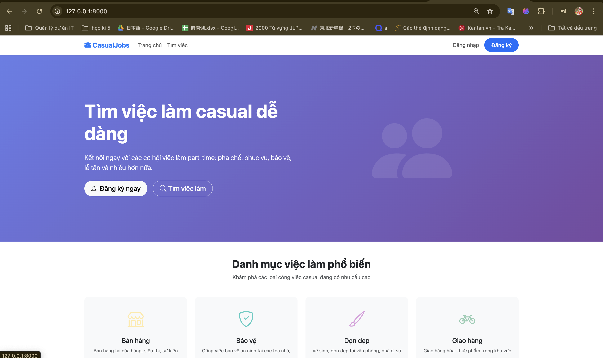
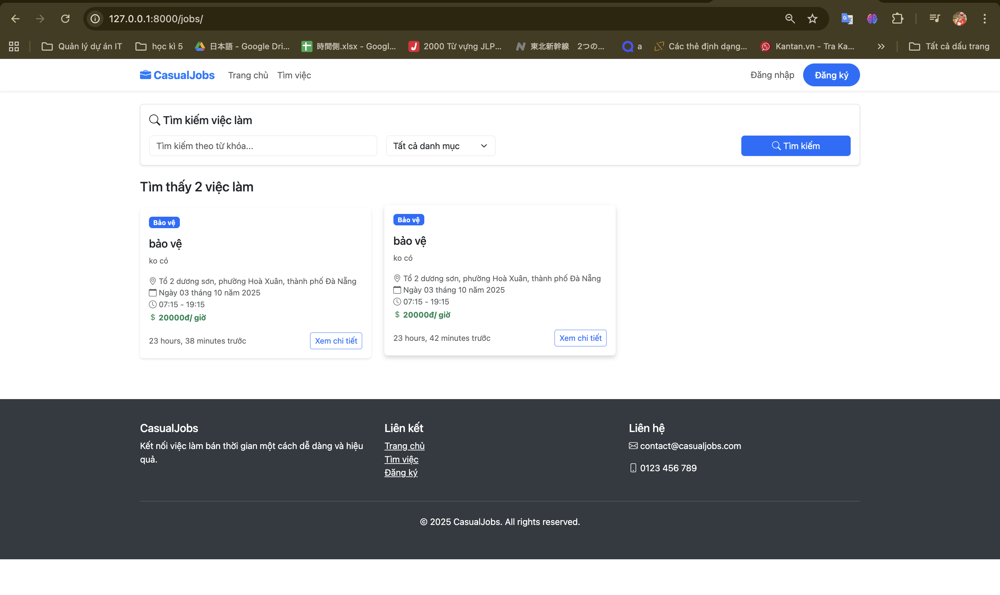
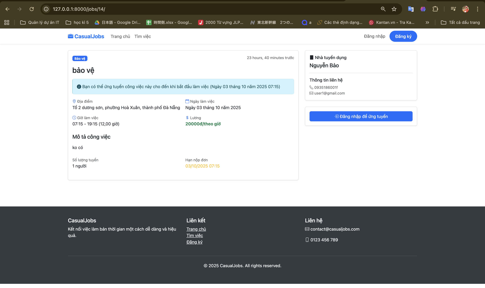
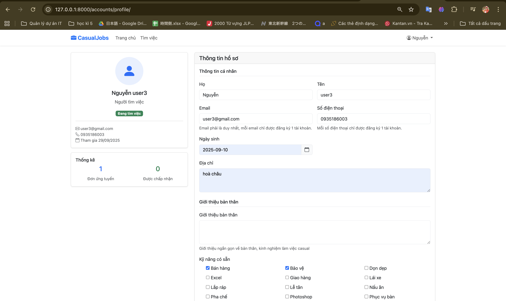

# Casual Jobs Connect


A Django-based web application connecting job seekers and employers in the part-time/cas## 👤 Developer

- Nguyen Huu Duy Bao - Sole Developer
  - Backend Development (Django)
  - Frontend Design
  - Project Management
  - Testing and Quality Assurance market.


## 📋 Introduction

Casual Jobs Connect is a platform that connects casual job seekers with employers. This application helps address flexible recruitment needs for part-time, shift-based, or hourly jobs, while creating quick employment opportunities for workers.

## ✨ Key Features

### For Job Seekers:
- Create personal profiles with skills and experience
- Search for jobs using multiple criteria (location, time, salary)
- Submit job applications quickly
- Track application status

### For Employers:
- Post detailed job listings
- Manage job applications
- Find suitable candidates based on skills

### For Administrators:
- Manage users and account verification
- Manage job categories
- Process reports and complaints


## 🛠️ Technologies Used

- **Backend**: Django (Python)
- **Frontend**: HTML, CSS, JavaScript, Bootstrap
- **Database**: SQLite (development)

## Project Structure

```
casual/
├── .git/                # Git directory
├── .gitignore           # Files/directories excluded from Git
├── README.md            # This file
├── docs/                # Documentation and images
│   └── images/          # Images for README
├── src/                 # Main application source code
│   ├── accounts/        # User management application
│   ├── casual_jobs_connect/  # Main project configuration
│   ├── jobs/            # Job management application
│   ├── templates/       # HTML Templates
│   ├── manage.py        # Django management script
│   └── dbpython.sqlite3 # SQLite database
└── env/                 # Python virtual environment (not included in Git)
```

## Installation

1. Clone repository
2. Create and activate virtual environment:
   ```bash
   cd casual
   python -m venv env
   source env/bin/activate  # On Unix/MacOS
   env\\Scripts\\activate  # On Windows
   ```
3. Install dependencies:
   ```bash
   pip install -r requirements.txt
   ```
4. Navigate to the src directory and run the server:
   ```bash
   cd src
   python manage.py runserver
   ```

## 📸 Application Interface

### Homepage


### Job Search


### Job Details


### User Profile


## Sample Accounts

### Admin
- Username: admin
- Password: admin123

### Employers
- Username: cafe_highland | Password: password123
- Username: nha_hang_golden | Password: password123
- Username: cty_bao_ve_an_ninh | Password: password123

### Job Seekers
- Username: nguyen_van_a | Password: password123
- Username: tran_thi_b | Password: password123
- Username: le_minh_c | Password: password123

## 🚀 Roadmap

- [ ] Payment integration for jobs
- [ ] Mobile app development
- [ ] Email and SMS notification system
- [ ] Social media authentication integration
- [ ] Advanced reporting and analytics system

## � Người phát triển

- Nguyễn Hữu Duy Bảo - Người phát triển duy nhất
  - Phát triển Backend (Django)
  - Thiết kế Frontend
  - Quản lý dự án
  - Kiểm thử và đảm bảo chất lượng

## 📞 Contact

If you have any questions or suggestions, please contact:

- Email: 9102005duybao@gmail.com
- Github: [Baotrh8805/casual_jobs](https://github.com/Baotrh8805/casual_jobs)
